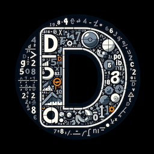

# Decimo (formerly DeciMojo) <!-- omit from toc -->



An arbitrary-precision integer and decimal library for [Mojo](https://www.modular.com/mojo), inspired by Python's `int` and `Decimal`.

[](https://github.com/forfudan/decimo/releases)
[](https://prefix.dev/channels/modular-community/packages/decimo)
[](https://github.com/forfudan/argmojo/actions/workflows/run_tests.yaml)
[](https://github.com/forfudan/argmojo/commits/main)

<!-- 
[](https://docs.modular.com/mojo/manual/)
[](LICENSE)
[](https://github.com/forfudan/argmojo/stargazers)
[](https://github.com/forfudan/argmojo/issues)

-->

<!-- 
[](https://github.com/forfudan/decimo/blob/main/docs/readme_zht.md)
[](https://github.com/forfudan/decimo/blob/main/docs/changelog.md)
[](https://github.com/forfudan/decimo)
[](https://discord.gg/3rGH87uZTk)
-->

## Overview

Decimo provides an arbitrary-precision integer and decimal library for Mojo. It delivers exact calculations for financial modeling, scientific computing, and applications where floating-point approximation errors are unacceptable. Beyond basic arithmetic, the library includes advanced mathematical functions with guaranteed precision.

For Pythonistas, `decimo.BInt` to Mojo is like `int` to Python, and `decimo.Decimal` to Mojo is like `decimal.Decimal` to Python.

The core types are[^auxiliary]:

- An arbitrary-precision signed integer type `BInt`[^bigint], which is a Mojo-native equivalent of Python's `int`.
- An arbitrary-precision decimal implementation (`Decimal`) allowing for calculations with unlimited digits and decimal places[^arbitrary], which is a Mojo-native equivalent of Python's `decimal.Decimal`.
- A 128-bit fixed-point decimal implementation (`Dec128`) supporting up to 29 significant digits with a maximum of 28 decimal places[^fixed].

| Type      | Other names          | Information                              | Internal representation |
| --------- | -------------------- | ---------------------------------------- | ----------------------- |
| `BInt`    | `BigInt`             | Equivalent to Python's `int`             | Base-2^32               |
| `Decimal` | `BDec`, `BigDecimal` | Equivalent to Python's `decimal.Decimal` | Base-10^9               |
| `Dec128`  | `Decimal128`         | 128-bit fixed-precision decimal type     | Triple 32-bit words     |

---

**Decimo** combines "**Deci**mal" and "**Mo**jo" - reflecting its purpose and implementation language. "Decimo" is also a Latin word meaning "tenth" and is the root of the word "decimal".

---

This repository includes a built-in [TOML parser](./docs/readme_toml.md) (`decimo.toml`), a lightweight pure-Mojo implementation supporting TOML v1.0. It parses configuration files and test data, supporting basic types, arrays, and nested tables. While created for Decimo's testing framework, it offers general-purpose structured data parsing with a clean, simple API.

## Installation

Decimo is available in the modular-community `https://repo.prefix.dev/modular-community` package repository. To access this repository, add it to your `channels` list in your `pixi.toml` file:

```toml
channels = ["https://conda.modular.com/max", "https://repo.prefix.dev/modular-community", "conda-forge"]
```

Then, you can install Decimo using any of these methods:

1. From the `pixi` CLI, run the command ```pixi add decimo```. This fetches the latest version and makes it immediately available for import.

1. In the `mojoproject.toml` file of your project, add the following dependency:

    ```toml
    decimo = "==0.8.0"
    ```

    Then run `pixi install` to download and install the package.

1. For the latest development version in the `main` branch, clone [this GitHub repository](https://github.com/forfudan/decimo) and build the package locally using the command `pixi run package`.

The following table summarizes the package versions and their corresponding Mojo versions:

| libary     | version | Mojo version  | package manager |
| ---------- | ------- | ------------- | --------------- |
| `decimojo` | v0.1.0  | ==25.1        | magic           |
| `decimojo` | v0.2.0  | ==25.2        | magic           |
| `decimojo` | v0.3.0  | ==25.2        | magic           |
| `decimojo` | v0.3.1  | >=25.2, <25.4 | pixi            |
| `decimojo` | v0.4.x  | ==25.4        | pixi            |
| `decimojo` | v0.5.0  | ==25.5        | pixi            |
| `decimojo` | v0.6.0  | ==0.25.7      | pixi            |
| `decimojo` | v0.7.0  | ==0.26.1      | pixi            |
| `decimo`   | v0.8.0  | ==0.26.1      | pixi            |

## Quick start

You can start using Decimo by importing the `decimo` module. An easy way to do this is to import everything from the `prelude` module, which provides the most commonly used types.

```mojo
from decimo import *
```

This will import the following types or aliases into your namespace:

- `BInt` (alias of `BigInt`): An arbitrary-precision signed integer type, equivalent to Python's `int`.
- `Decimal` or `BDec` (aliases of `BigDecimal`): An arbitrary-precision decimal type, equivalent to Python's `decimal.Decimal`.
- `Dec128` (alias of `Decimal128`): A 128-bit fixed-precision decimal type.
- `RoundingMode`: An enumeration for rounding modes.
- `ROUND_DOWN`, `ROUND_HALF_UP`, `ROUND_HALF_EVEN`, `ROUND_UP`: Constants for common rounding modes.

---

Here are some examples showcasing the arbitrary-precision feature of the `Decimal` type. For some mathematical operations, the default precision (number of significant digits) is set to `28`. You can change the precision by passing the `precision` argument to the function. This default precision will be configurable globally in future when Mojo supports global variables.

```mojo
from decimo.prelude import *


fn main() raises:
    var a = BDec("123456789.123456789")  # BDec is an alias for BigDecimal
    var b = Decimal(
        "1234.56789"
    )  # Decimal is a Python-like alias for BigDecimal

    # === Basic Arithmetic === #
    print(a + b)  # 123458023.691346789
    print(a - b)  # 123455554.555566789
    print(a * b)  # 152415787654.32099750190521
    print(a.true_divide(b + 1))  # 99919.06565608207008357913866

    # === Exponential Functions === #
    print(a.sqrt(precision=80))
    # 11111.111066111110969430554981749302328338130654689094538188579359566416821203641
    print(a.cbrt(precision=80))
    # 497.93385938415242742001134219007635925452951248903093962731782327785111102410518
    print(a.root(b, precision=80))
    # 1.0152058862996527138602610522640944903320735973237537866713119992581006582644107
    print(a.power(b, precision=80))
    # 3.3463611024190802340238135400789468682196324482030786573104956727660098625641520E+9989
    print(a.exp(precision=80))
    # 1.8612755889649587035842377856492201091251654136588338983610243887893287518637652E+53616602
    print(a.log(b, precision=80))
    # 2.6173300266565482999078843564152939771708486260101032293924082259819624360226238
    print(a.ln(precision=80))
    # 18.631401767168018032693933348296537542797015174553735308351756611901741276655161

    # === Trigonometric Functions === #
    print(a.sin(precision=200))
    # 0.99985093087193092464780008002600992896256609588456
    #   91036188395766389946401881352599352354527727927177
    #   79589259132243649550891532070326452232864052771477
    #   31418817041042336608522984511928095747763538486886
    print(b.cos(precision=1000))
    # -0.9969577603867772005841841569997528013669868536239849713029893885930748434064450375775817720425329394
    #    9756020177557431933434791661179643984869397089102223199519409695771607230176923201147218218258755323
    #    7563476302904118661729889931783126826250691820526961290122532541861737355873869924820906724540889765
    #    5940445990824482174517106016800118438405307801022739336016834311018727787337447844118359555063575166
    #    5092352912854884589824773945355279792977596081915868398143592738704592059567683083454055626123436523
    #    6998108941189617922049864138929932713499431655377552668020889456390832876383147018828166124313166286
    #    6004871998201597316078894718748251490628361253685772937806895692619597915005978762245497623003811386
    #    0913693867838452088431084666963414694032898497700907783878500297536425463212578556546527017688874265
    #    0785862902484462361413598747384083001036443681873292719322642381945064144026145428927304407689433744
    #    5821277763016669042385158254006302666602333649775547203560187716156055524418512492782302125286330865

    # === Internal representation of the number === #
    (
        Decimal(
            "3.141592653589793238462643383279502884197169399375105820974944"
        ).power(2, precision=60)
    ).print_internal_representation()
    # Internal Representation Details of BigDecimal
    # ----------------------------------------------
    # number:         9.8696044010893586188344909998
    #                 761511353136994072407906264133
    #                 5
    # coefficient:    986960440108935861883449099987
    #                 615113531369940724079062641335
    # negative:       False
    # scale:          59
    # word 0:         62641335
    # word 1:         940724079
    # word 2:         113531369
    # word 3:         99987615
    # word 4:         861883449
    # word 5:         440108935
    # word 6:         986960
    # ----------------------------------------------
```

---

Here is a comprehensive quick-start guide showcasing each major function of the `BInt` type.

```mojo
from decimo.prelude import *


fn main() raises:
    # === Construction ===
    var a = BInt("12345678901234567890")  # From string
    var b = BInt(12345)  # From integer
    var c = BInt("1991_10,18")  # From string with separators and spaces
    print(a, b, c)

    # === Basic Arithmetic ===
    print(a + b)  # Addition: 12345678901234580235
    print(a - b)  # Subtraction: 12345678901234555545
    print(a * b)  # Multiplication: 152415787814108380241050

    # === Division Operations ===
    print(a // b)  # Floor division: 999650944609516
    print(a.truncate_divide(b))  # Truncate division: 999650944609516
    print(a % b)  # Modulo: 9615

    # === Power Operation ===
    print(BInt(2).power(10))  # Power: 1024
    print(BInt(2) ** 10)  # Power (using ** operator): 1024

    # === Comparison ===
    print(a > b)  # Greater than: True
    print(a == BInt("12345678901234567890"))  # Equality: True
    print(a.is_zero())  # Check for zero: False

    # === Type Conversions ===
    print(String(a))  # To string: "12345678901234567890"

    # === Sign Handling ===
    print(-a)  # Negation: -12345678901234567890
    print(
        abs(BInt("-12345678901234567890"))
    )  # Absolute value: 12345678901234567890
    print(a.is_negative())  # Check if negative: False

    # === Extremely large numbers ===
    # 3600 digits // 1800 digits
    print(BInt("123456789" * 400) // BInt("987654321" * 200))

    # === Greatest common divisor ===
    print(a.gcd(b))  # Greatest common divisor: 15
    print(a.gcd(c))  # Greatest common divisor: 6
```

---

Here is a comprehensive quick-start guide showcasing each major function of the `Dec128` type.

```mojo
from decimo.prelude import *

fn main() raises:
    # === Construction ===
    var a = Dec128("123.45")                         # From string
    var b = Dec128(123)                              # From integer
    var c = Dec128(123, 2)                           # Integer with scale (1.23)
    var d = Dec128.from_float(3.14159)               # From floating-point
    
    # === Basic Arithmetic ===
    print(a + b)                                     # Addition: 246.45
    print(a - b)                                     # Subtraction: 0.45
    print(a * b)                                     # Multiplication: 15184.35
    print(a / b)                                     # Division: 1.0036585365853658536585365854
    
    # === Rounding & Precision ===
    print(a.round(1))                                # Round to 1 decimal place: 123.5
    print(a.quantize(Dec128("0.01")))                # Format to 2 decimal places: 123.45
    print(a.round(0, RoundingMode.ROUND_DOWN))       # Round down to integer: 123
    
    # === Comparison ===
    print(a > b)                                     # Greater than: True
    print(a == Dec128("123.45"))                     # Equality: True
    print(a.is_zero())                               # Check for zero: False
    print(Dec128("0").is_zero())                     # Check for zero: True
    
    # === Type Conversions ===
    print(Float64(a))                                # To float: 123.45
    print(a.to_int())                                # To integer: 123
    print(a.to_str())                                # To string: "123.45"
    print(a.coefficient())                           # Get coefficient: 12345
    print(a.scale())                                 # Get scale: 2
    
    # === Mathematical Functions ===
    print(Dec128("2").sqrt())                        # Square root: 1.4142135623730950488016887242
    print(Dec128("100").root(3))                     # Cube root: 4.641588833612778892410076351
    print(Dec128("2.71828").ln())                    # Natural log: 0.9999993273472820031578910056
    print(Dec128("10").log10())                      # Base-10 log: 1
    print(Dec128("16").log(Dec128("2")))             # Log base 2: 3.9999999999999999999999999999
    print(Dec128("10").exp())                        # e^10: 22026.465794806716516957900645
    print(Dec128("2").power(10))                     # Power: 1024
    
    # === Sign Handling ===
    print(-a)                                        # Negation: -123.45
    print(abs(Dec128("-123.45")))                    # Absolute value: 123.45
    print(Dec128("123.45").is_negative())            # Check if negative: False
    
    # === Special Values ===
    print(Dec128.PI())                               # π constant: 3.1415926535897932384626433833
    print(Dec128.E())                                # e constant: 2.7182818284590452353602874714
    print(Dec128.ONE())                              # Value 1: 1
    print(Dec128.ZERO())                             # Value 0: 0
    print(Dec128.MAX())                              # Maximum value: 79228162514264337593543950335
    
    # === Convenience Methods ===
    print(Dec128("123.400").is_integer())            # Check if integer: False
    print(a.number_of_significant_digits())          # Count significant digits: 5
    print(Dec128("12.34").to_str_scientific())       # Scientific notation: 1.234E+1
```

## Objective

Financial calculations and data analysis require precise decimal arithmetic that floating-point numbers cannot reliably provide. As someone working in finance and credit risk model validation, I needed a dependable correctly-rounded, fixed-precision numeric type when migrating my personal projects from Python to Mojo.

Since Mojo currently lacks a native Decimal type in its standard library, I decided to create my own implementation to fill that gap.

This project draws inspiration from several established decimal implementations and documentation, e.g., [Python built-in `Decimal` type](https://docs.python.org/3/library/decimal.html), [Rust `rust_decimal` crate](https://docs.rs/rust_decimal/latest/rust_decimal/index.html), [Microsoft's `Decimal` implementation](https://learn.microsoft.com/en-us/dotnet/api/system.decimal.getbits?view=net-9.0&redirectedfrom=MSDN#System_Decimal_GetBits_System_Decimal_), [General Decimal Arithmetic Specification](https://speleotrove.com/decimal/decarith.html), etc. Many thanks to these predecessors for their contributions and their commitment to open knowledge sharing.

## Status

Rome wasn't built in a day. Decimo is currently under active development. It has successfully progressed through the **"make it work"** phase and the **"make it right"**, and is now well into the **"make it fast"** phase.

The `BInt` type is fully implemented and optimized. It has been benchmarked against Python's `int` and demonstrates superior performance in most cases.

Bug reports and feature requests are welcome! If you encounter issues, please [file them here](https://github.com/forfudan/decimo/issues).

## Tests and benches

After cloning the repo onto your local disk, you can:

- Use `pixi run test` to run tests.
- Use `pixi run bench` to run benchmarks.

## Citation

If you find Decimo useful, consider listing it in your citations.

```tex
@software{Zhu.2026,
    author       = {Zhu, Yuhao},
    year         = {2026},
    title        = {Decimo: An arbitrary-precision integer and decimal library for Mojo},
    url          = {https://github.com/forfudan/decimo},
    version      = {0.8.0},
    note         = {Computer Software}
}
```

## License

This repository and its contributions are licensed under the Apache License v2.0.

[^fixed]: The `Decimal128` type can represent values with up to 29 significant digits and a maximum of 28 digits after the decimal point. When a value exceeds the maximum representable value (`2^96 - 1`), Decimo either raises an error or rounds the value to fit within these constraints. For example, the significant digits of `8.8888888888888888888888888888` (29 eights total with 28 after the decimal point) exceeds the maximum representable value (`2^96 - 1`) and is automatically rounded to `8.888888888888888888888888889` (28 eights total with 27 after the decimal point). Decimo's `Decimal128` type is similar to `System.Decimal` (C#/.NET), `rust_decimal` in Rust, `DECIMAL/NUMERIC` in SQL Server, etc.
[^bigint]: The `BigInt` implementation uses a base-2^32 representation with a little-endian format, where the least significant word is stored at index 0. Each word is a `UInt32`, allowing for efficient storage and arithmetic operations on large integers. This design choice optimizes performance for binary computations while still supporting arbitrary precision.
[^auxiliary]: The auxiliary types include a base-10 arbitrary-precision signed integer type (`BigInt10`) and a base-10 arbitrary-precision unsigned integer type (`BigUInt`) supporting unlimited digits[^bigint10]. `BigUInt` is used as the internal representation for `BigInt10` and `Decimal`.
[^bigint10]: The BigInt10 implementation uses a base-10 representation for users (maintaining decimal semantics), while internally using an optimized base-10^9 storage system for efficient calculations. This approach balances human-readable decimal operations with high-performance computing. It provides both floor division (round toward negative infinity) and truncate division (round toward zero) semantics, enabling precise handling of division operations with correct mathematical behavior regardless of operand signs.
[^arbitrary]: Built on top of our completed BigInt10 implementation, BigDecimal will support arbitrary precision for both the integer and fractional parts, similar to `decimal` and `mpmath` in Python, `java.math.BigDecimal` in Java, etc.
